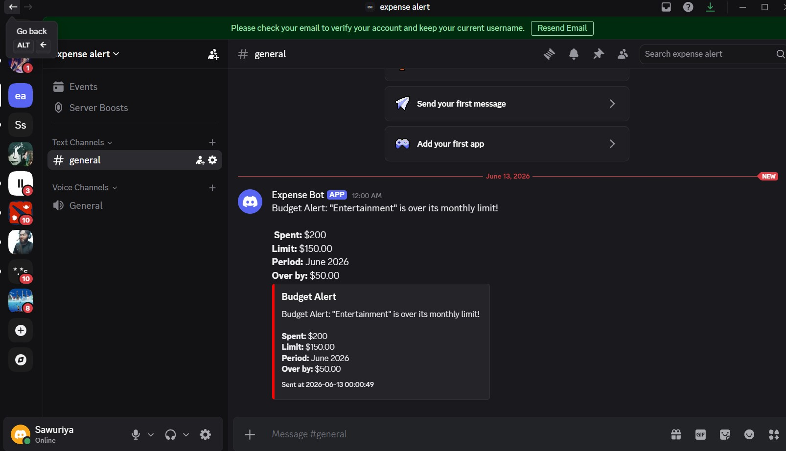

# Expense Tracker API

Django REST Framework backend for tracking personal spending with authentication, multi-currency support, budget alerts, and advanced filtering.

## Setup

```bash
uv sync
cp .env.example .env
uv run python manage.py migrate
uv run python manage.py runserver
```

### .env Configuration

```dotenv
SECRET_KEY=your-django-secret-key
DEBUG=True
BASE_CURRENCY=USD
EXCHANGE_RATE_API_URL=https://open.er-api.com/v6/latest
DISCORD_WEBHOOK_URL=https://discord.com/api/webhooks/YOUR_ID/YOUR_TOKEN
```

---

## My Features

### 1. Authentication

**Overview:**
Token-based authentication. Users can only access their own expenses and categories.

**Design Decisions:**
- Django REST Framework TokenAuthentication
- User ownership enforced: `.filter(user=request.user)`
- All endpoints protected with `@permission_classes([IsAuthenticated])`

**API Changes:**
POST /api/auth/login/

**Example Request/Response:**

Request:
```json
{
  "username": "alice",
  "password": "password123"
}
```

Response:
```json
{
  "token": "abc123xyz..."
}
```

**Assumptions:**
- Token provided in `Authorization: Token <token>` header
- Users isolated from each other (cannot access others' data)

**Known Limits:**
- Token never expires
- No refresh token mechanism

---

### 2. Currency Conversion

**Overview:**
Record expenses in multiple currencies (EUR, JPY, GBP, etc.). Summaries automatically convert to BASE_CURRENCY using live exchange rates.

**Design Decisions:**
- `currency` field added to Expense model (ISO 4217 code, default USD)
- Exchange rates fetched from open.er-api.com (free API)
- Amounts stored in original currency; conversion happens at reporting
- Used `Decimal` for financial precision (not float)

**API Changes:**
- New field: `currency` on Expense (optional, defaults to USD)
- Summary endpoint converts all amounts to BASE_CURRENCY

**Example Request/Response:**

Create Expense (EUR):
```bash
POST /api/expenses/
{
  "title": "Hotel in Paris",
  "amount": "120.00",
  "currency": "EUR",
  "category": 1,
  "date": "2026-06-12"
}
```

Response:
```json
{
  "id": 7,
  "title": "Hotel in Paris",
  "amount": "120.00",
  "currency": "EUR",
  "category": 1,
  "date": "2026-06-12"
}
```

Summary with Conversion:
```bash
GET /api/expenses/summary/
```

Response:
```json
{
  "base_currency": "USD",
  "categories": [
    {
      "category": "Travel",
      "total": "179.60",
      "rate": "1.08",
      "as_of": "2026-06-12"
    }
  ]
}
```

**Assumptions:**
- Exchange rates are stable (not cached)
- All currency codes are valid ISO 4217 codes
- BASE_CURRENCY is always USD

**Known Limits:**
- No exchange rate caching (can be slow with many requests)
- Free API has rate limits
- No historical rate tracking

---

### 3. Budget Threshold Bot Alerts

**Overview:**
Set monthly spending limits per category. When spending exceeds the limit, Discord bot sends a real-time alert.

**Design Decisions:**
- Added `monthly_limit` field to Category
- Alert triggered after expense creation/update
- Uses Discord webhooks (free, no bot account needed)
- Checks current month-to-date total using aggregation

**API Changes:**
- New field: `monthly_limit` on Category (optional)
- Alert sent when expense pushes category over limit

**Example Request/Response:**

Create Category with Budget:
```bash
POST /api/categories/
{
  "name": "Dining",
  "description": "Restaurants",
  "monthly_limit": "200.00"
}
```

Response:
```json
{
  "id": 1,
  "name": "Dining",
  "description": "Restaurants",
  "monthly_limit": "200.00"
}
```

Create Expense (Triggers Alert):
```bash
POST /api/expenses/
{
  "title": "Dinner",
  "amount": "150.00",
  "currency": "USD",
  "category": 1,
  "date": "2026-06-12"
}
```

If month total exceeds limit → Discord alert sent:
Budget Alert: "Dining" is over its monthly limit!
 Spent: $300.00
 Limit: $200.00
 Period: June 2026
 Over by: $100.00

 **Screenshot of Delivered Alert:**



**Assumptions:**
- Budget checked only when expense is created/updated
- Alert sent once per month when limit exceeded
- Month is calendar month (1st to end)

**Known Limits:**
- No alert history stored
- Only first currency conversion shown in alert
- No repeated alerts for same month

---

### 4. Expense Search/Filtering

**Overview:**
Advanced filtering for expenses. Search by keyword, amount range, category, and date. Multiple filters combine with AND logic.

**Design Decisions:**
- Used Django's `Q` objects for OR logic in search
- Case-insensitive search using `__icontains`
- Results ordered by date (newest first)
- `.select_related('category')` for query optimization

**API Changes:**
- Query parameters: `search`, `min_amount`, `max_amount`, `category`, `start_date`, `end_date`

**Example Request/Response:**

Search by Keyword:
```bash
GET /api/expenses/?search=hotel
```

Response:
```json
[
  {
    "id": 2,
    "title": "Luxury Hotel Paris",
    "amount": "200.00",
    "currency": "USD",
    "category": 1,
    "date": "2026-06-11"
  },
  {
    "id": 1,
    "title": "Budget Hotel",
    "amount": "50.00",
    "currency": "USD",
    "category": 1,
    "date": "2026-06-10"
  }
]
```

Filter by Amount Range:
```bash
GET /api/expenses/?min_amount=50&max_amount=100
```

Combined Filters:
```bash
GET /api/expenses/?search=hotel&min_amount=100&category=1&start_date=2026-06-01
```

**Assumptions:**
- Search is case-insensitive
- Multiple filters use AND logic (all must match)
- Search checks title and notes only

**Known Limits:**
- No full-text search (simple substring matching)
- Can't exclude categories (only include specific ones)
- No search result ranking

---

### 5. Monthly Spending Summaries

**Overview:**
View spending grouped by month (YYYY-MM) with category breakdown. Helps identify spending trends.

**Design Decisions:**
- Groups expenses by `date.strftime("%Y-%m")`
- Aggregates amount and count per month
- Shows category breakdown for each month
- Sorted by month (newest first)

**API Changes:**
- New endpoint: `GET /api/expenses/monthly-summary/`

**Example Request/Response:**

```bash
GET /api/expenses/monthly-summary/
```

Response:
```json
{
  "summary": [
    {
      "month": "2026-06",
      "total": "575.00",
      "count": 4,
      "categories": [
        {"category": "Food", "total": "75.00"},
        {"category": "Travel", "total": "500.00"}
      ]
    },
    {
      "month": "2026-05",
      "total": "175.00",
      "count": 3,
      "categories": [
        {"category": "Food", "total": "60.00"},
        {"category": "Travel", "total": "115.00"}
      ]
    }
  ]
}
```

**Assumptions:**
- Calendar month (1st to end)
- No data for months with zero expenses
- Categories sorted alphabetically

**Known Limits:**
- No year-over-year comparison
- No trend indicators
- All amounts summed (no averaging)

---

## Bugs Found and Fixed

### Bug 1: Serializer Field Typo (`catgory` → `category`)

**Description:**
Expense serializer had typo in fields list: `"catgory"` instead of `"category"`.

**Root Cause:**
Typo in `expenses/serializers.py` line 12.

**Fix:**
```python
# BEFORE
fields = ["id", "title", "amount", "catgory", "date", "notes"]

# AFTER
fields = ["id", "title", "amount", "category", "date", "notes"]
```

**Commit Hash:d32794f**

---

### Bug 2: Variable Name Typo (`serialzer` → `serializer`)

**Description:**
Expense creation response referenced typo: `serialzer.data` instead of `serializer.data`.

**Root Cause:**
Typo in `expenses/views.py` line 51 in `expense_list()` POST handler.

**Fix:**
```python
# BEFORE
return Response(serialzer.data, status=status.HTTP_201_CREATED)

# AFTER
return Response(serializer.data, status=status.HTTP_201_CREATED)
```

**Commit Hash:58c2f7c**

---

### Bug 3: Date Filtering (exclusive `__gt` → inclusive `__gte`)

**Description:**
Start date filter was exclusive. Expenses on start_date were excluded instead of included.

**Root Cause:**
Wrong lookup operator in `expenses/views.py` line 40. Spec required inclusive filtering.

**Fix:**
```python
# BEFORE
expenses = expenses.filter(date__gt=start_date)

# AFTER
expenses = expenses.filter(date__gte=start_date)
```

**Commit Hash:a54e490**

---

### Bug 4: Missing Import (`Sum`)

**Description:**
`Sum` aggregation function not imported, causing NameError when generating summaries.

**Root Cause:**
Missing import in `expenses/views.py`.

**Fix:**
```python
# ADDED
from django.db.models import Sum
```

**Commit Hash:01f8410**

---

### Bug 5: URL Pattern Ordering

**Description:**
Summary endpoint returned 404 because generic `<pk>/` pattern matched before specific `summary/` pattern.

**Root Cause:**
Django matches URL patterns top-to-bottom. `expenses/<pk>/` matched `expenses/summary/` and tried to use "summary" as PK (integer).

**Fix:**
```python
# BEFORE
urlpatterns = [
    path("expenses/", views.expense_list, name="expense-list"),
    path("expenses/<pk>/", views.expense_detail, name="expense-detail"),
    path("expenses/summary/", views.expense_summary, name="expense-summary"),
]

# AFTER
urlpatterns = [
    path("expenses/", views.expense_list, name="expense-list"),
    path("expenses/summary/", views.expense_summary, name="expense-summary"),
    path("expenses/<pk>/", views.expense_detail, name="expense-detail"),
]
```

**Commit Hash:605e103**

---

## Testing

Import `postman_collection.json` into Postman and test all endpoints.

---

## Tech Stack

- Django 5 · Django REST Framework
- SQLite · Token Authentication
- open.er-api.com (Exchange Rates)
- Discord Webhooks (Alerts)
- uv (Package Manager)